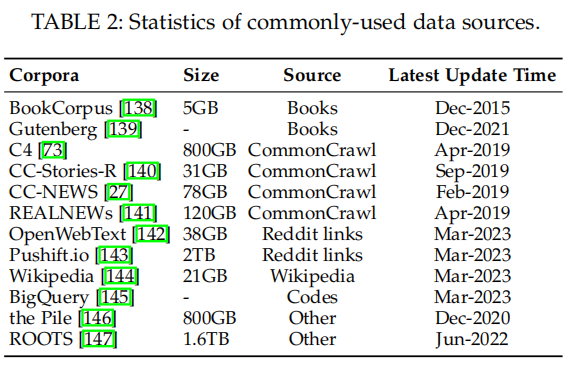
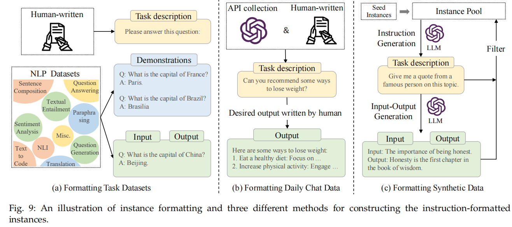
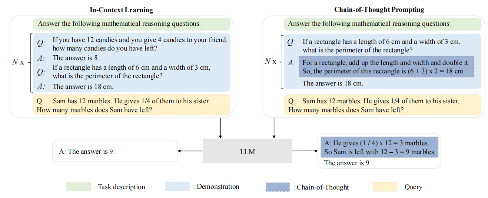

# 大模型综述

**参考博客：**

https://zhuanlan.zhihu.com/p/630203554

https://www.cnblogs.com/David-deng/p/17786107.html

https://zhuanlan.zhihu.com/p/662673023

https://blog.csdn.net/qq_41185868/article/details/131565801

https://mp.weixin.qq.com/s/yIsHsZL2Kbav0LvTUry_dg

## 1.引言

语言模型的四个发展阶段：

### 统计语言模型（SLM）

20世纪90年代，学术界对于统计语言模型(SLM)的研究开始兴起。

**基于马尔可夫假设建立词预测模型**，例如根**据最近的上下文预测下一个词**，例如bigram 和 trigram 语言模型。

- bi-gram语言模型：当前词出现的概率只与上一个词出现的概率相关
- tri-gram语言模型：当前词出现的概率只与上两个词出现的概率相关

SLM 已被广泛应用于提高信息检索（IR） 和自然语言处理（NLP）任务。

问题：**维数灾难.需要估计指数级数量的转换概率**，因此很难准确估计高阶语言模型。因此，设计专门的平滑策略，如回退估计和古德图灵估计.

### 神经语言模型(NLM)

通过神经网络，如循环神经网络（RNN），来**描述单词序列的概率**。在聚合上下文特征（即分布式词向量）的条件下构建词预测函数。

**word2vec  提出了构建一个简化的浅层神经网络来学习分布式单词表示的方法.**

这些研究开创了**将语言模型用于表示学习（超越词序列建模）的应用**

### 预训练语言模型 (PLM)

ELMo被提出**通过预训练**一个双向 LSTM（biLSTM）**网络**（而不是学习固定的词表示）**来捕捉上下文感知的词表示，然后根据特定的下游任务微调 biLSTM 网络**。

进一步，**基于自注意力机制的高度并行化 Transformer 架构** [22]，BERT [23] 作为双向语言模型，在大规模无标签语料库上使用专门设计的预训练任务。这些**预训练的上下文感知词表示作为通用语义特征非常有效**，其极大地提高了 NLP 任务的性能。

确立了“预训练和微调”学习范式。已经建立了大量关于 PLM 的研究，这些研究引入了不同的架构 [24, 25]（例如 GPT-2 [26] 和 BART [24]）或改进的预训练策略 [27–29]。在这个范式中，通常需要对 PLM进行微调以适配不同的下游任务。

### 大语言模型(LLM)

扩展 PLM（例如扩展模型大小或数据大小）通常会提高下游任务的模型性能（即遵循扩展法则 [30]）。许多研究通过训练越来越大的 PLM（例如 1750 亿参数的 GPT-3 和 5400 亿参数的 PaLM）来探索性能极限。

大规模的 PLM 与较小的 PLM表现出不同的行为，并在解决一系列复杂任务中展示了惊人的能力（称为涌现能力）。

例如，GPT-3 可以通过上下文学习（in-context learning, ICL）来解决小样本任务，而 GPT-2 则表现不佳。

研究界将这些大规模的 PLM 命名为“大语言模型”

通常，大型语言模型（LLM）是指包含数千亿（或更多）参数的语言模型，这些参数是在大量文本数据上训练的，例如模型 GPT-3、PaLM、Galactica 和 LLaMA。具体来说，LLM 建立在 Transformer 架构之上，其中多头注意力层堆叠在一个非常深的神经网络中。现有的 LLM 主要采用与小语言模型类似的模型架构（即 Transformer）和预训练目标（即语言建模）。作为主要区别，LLM 在很大程度上扩展了模型大小、预训练数据和总计算量（扩大倍数）。他们可以更好地理解自然语言，并根据给定的上下文（例如 prompt）生成高质量的文本。这种容量改进可以用标度律进行部分地描述，其中性能大致遵循模型大小的大幅增加而增加。然而根据标度律，某些能力（例如，上下文学习）是不可预测的，只有当模型大小超过某个水平时才能观察到。

### LLM vs PLM

- wikipedia：大语言模型 (英语：large language model，LLM) 是一种语言模型，由具有许多参数（通常数十亿个权重或更多）的人工神经网络组成，使用自监督学习或半监督学习对大量未标记文本进行训练。大型语言模型在2018年左右出现，并在各种任务中表现出色。

- 本综述的观点：大语言模型是指包含数千亿（或更多）参数的Transformer语言模型，这些模型是在大规模文本数据上进行训练的，例如GPT-3，PaLM，Galactica 和 LLaMA。
- 我的理解：
  - 通过上面的回答我们可以看出，现在的研究中并没有对于多大的模型才能算作大语言模型有一个确切的定义。通常大语言模型一般拥有数十亿或者更多的参数。
  - 对于本综述的观点我并不是非常的认可。因为我们知道 LLaMA 2 拥有三个版本，参数量分别是7B、13B和70B，没有达到综述中的千亿参数的规模，但是 LLaMA 2 还是被大家公认为是一个预训练的大语言模型。

1.**LLM具有涌现能力(emergent abilities)：这是llm能解决复杂任务的关键**

2.LLM 将彻底改变人类开发和使用人工智能算法的方式。

3.LLM 的发展不再明确区分研究和工程。训练 LLM 需要在大规模数据处理和分布式并行训练方面具有丰富的实践经验，研究人员需要与工程人员合作。

### LLM机遇与挑战

#### 影响

ChatGPT 和 GPT-4 的出现促使人们重新思考通用人工智能（AGI）的可能性。

在 NLP 领域，LLM 可以在一定程度上作为通用语言任务解决器，研究范式已经转向使用 LLM。在 IR 领域，传统搜索引擎正受到通过 AI 聊天机器人（即 ChatGPT）搜索新信息的挑战。在计算机视觉（CV）领域，研究人员试图开发类似 ChatGPT 的视觉-语言模型，以更好地为多模态对话提供服务。

#### 问题

**其基本原理尚未得到充分探索。**

**涌现能力的出现难以解释。研究界缺乏对 LLM 优越能力的关键因素进行深入、详细的研究调查**

研究界很难训练出有能力的 LLM。由于计算资源的巨大需求，为了研究训练 LLM 的各种策略的效果，进行重复、消融研究的成本非常高

将 LLM 与人类价值观或偏好保持一致是具有挑战的。

## 2.概述

### 2.1背景

为了对 LLM 的工作原理有一个快速的了解，本部分将介绍 LLM 的基本背景，包括扩展法则、涌现能力和关键技术。

#### 扩展法则 Scaling Laws

**现有的llm采用与小型语言模型类似的Transformer体系结构和预训练目标（例如，语言建模），但大幅度扩展了模型规模、数据规模和总计算量（数量级）。**

扩展可以大幅提高 LLM 的模型能力**，因此，建立一个定量的方法来描述扩展效应是有意义的**。

两个代表性工作：

（1）KM scaling law：2020年，Kaplan等人（OpenAI团队）首次提出建模模型参数和三个主要因素（即模型大小N、数据集大小D、训练计算量C）之间的幂律关系。

其中L(·)表示使用纳特（nats：在信息论中，nats是自然对数的单位，用于度量信息量或信息熵。它是以自然对数的底数e为基础，表示信息的相对量——from ChatGPT）**表示的交叉熵损失**。这三个定律是在一些假设(例如，一个因素的分析不应该受到其他两个因素的瓶颈)下，通过拟合不同数据大小(22M到23B个tokens)、模型大小(768M到1.5B个非嵌入参数)和训练计算的模型性能得出的。
这里，Nc、Dc和Cc分别以非嵌入参数的数量、训练tokens的数量和FP天数来衡量。
（2）Chinchilla Scaling law：作为另一项具有代表性的研究，Hoffmann等人（谷歌DeepMind团队）提出了一种缩放定律的替代形式，以指导LLM的计算优化训练。

其中 *E* = 1*.*69*, A* = 406*.*4*, B* = 410*.*7，*α* = 0*.*34 和 *β* = 0*.*28。通过在约束条件 *C* *≈* 6*ND* 下优化损失 *L*(*N, D*)，他们展示了将计算预算最优地分配给模型大小和数据大小的方法（如下）：

随着给定计算预算的增加，**KM 扩展法则更偏向于将更大的预算分配给模型大小，而 Chinchilla 扩展法则则认为模型大小和数据大小应该以相同的比例增加**，即在公式 (3)中的 *a* 和 *b* 取相近的值。

#### 涌现能力 emergent abilities

涌现：在小型模型中不存在但在大型模型中产生的能力。这是区别 LLM 与先前 PLM 的最显著特征之一

LLM 的三种典型涌现能力和具备这种能力的代表性模型：

##### 上下文学习 In-context learning

为语言模型提供一个自然语言指令和/或几个任务示例，它就可以通过完成输入文本的单词序列的方式来为测试实例生成预期的输出，而无需额外的训练或梯度更新。这种能力还取决于具体的下游任务。

在 GPT系列模型中，1750 亿的 GPT-3 模型在一般情况下表现出强大的 ICL 能力，但 GPT-1 和 GPT-2 模型则没有。然

##### 指令遵循 Instruction following

微调 基于自然语言描述来格式化的多任务混合数据集。对于没见过的按照指令的形式描述的任务，LLMs可以在做得很好。

通过指令微调，LLM 能够在没有使用显式示例的情况下遵循新的任务指令，因此它具有更好的泛化能力。

##### 逐步推理Step-by-step reasoning

通过使用思维链（Chain-of-Thought, CoT）提示策略 [32]，LLM 可以通过利用包含中间推理步骤的提示机制来解决复杂推理任务

#### 关键技术

##### Scaling 扩展

在Transformer语言模型中存在明显的缩放效应:更大的模型/数据大小和更多的训练计算通常会导致模型能力的改进。
此外，由于计算预算通常是有限的，因此可以使用缩放定律来进行计算效率更高的计算资源分配。
例如，Chinchilla(具有更多的训练tokens)通过在相同的计算预算下增加数据规模超过了其对应模型Gopher(具有更大的模型大小)。
然而，应该注意的是，数据缩放应该伴随着仔细的清理过程，因为预训练数据的质量在模型能力中起着关键作用。

##### Training 训练

为了支持分布式训练，已经发布了几个优化框架来促进并行算法的实现和部署，例如DeepSpeed和Megatron-LM。
此外，优化技巧对于训练稳定性和模型性能也很重要，例如重新启动以克服训练损失尖峰和混合精度训练。
最近，GPT-4提出开发特殊的基础设施和优化方法，用小得多的模型可靠地预测大型模型的性能。

##### Ability Eliciting 能力引导

作为一种技术方法，设计合适的任务指令或特定的上下文学习策略来诱导这种能力是有用的。
例如，思维链提示，即通过中间推理步骤以解决复杂的推理任务，已被证明是有用的。
此外，我们还可以对LLMs进行指令微调，用自然语言表达任务描述，提高LLMs对不曾见过的任务的泛化能力。

##### Alignment Tuning 对齐微调

有必要使 LLM 与人类价值观保持一致，例如有用性、诚实性和无害性。

为此，InstructGPT设计了一种有效的调优方法，使llm能够遵循预期的指令，该方法利用了带有人类反馈的强化学习技术（RLHF）。
ChatGPT确实是在与InstructGPT类似的技术基础上开发的，其在产生高质量、无害的回复方面显示出强大的对齐能力，例如，拒绝回答侮辱性的问题。

##### Tool Manipulation 工具操作

从本质上讲，LLMs在大量纯文本语料库上被训练为文本生成器，因此在不能最好地以文本形式表达的任务(例如，数值计算)上表现不佳。此外，它们的能力也局限于预训练数据，例如，无法获取最新信息。为了解决这些问题，最近提出的一种技术是使用外部工具来弥补LLMs的不足。
例如，LLMs可以利用计算器进行精确计算，利用搜索引擎检索未知信息。最近，ChatGPT启用了使用外部插件(现有或新创建的应用程序)的机制，这被类比为LLMs的“眼睛和耳朵”。这种机制可以广泛扩展 LLM 的能力范围。

### 2.2技术演进

GPT模型的基本原理是通过语言建模将世界知识压缩为仅含解码器的Transformer模型，从而恢复（或记忆）世界知识的语义，并充当通用任务求解器。成功的两个关键点是 (1)只训练解码器的Transformer语言模型，可以准确地预测下一个词  (2) 扩大语言模型的规模

##### 早期探索阶段

随着 Transformer 的出现，OpenAI开发了两个初始的 GPT 模型，即GPT-1和GPT-2

GPT表示生成式预训练（*Generative Pre-Training*）。GPT-1是基于生成式、仅解码器的Transformer架构开发的，采用了无监督预训练和有监督微调的混合方法。

GPT-2采用与GPT-1类似的架构，将参数尺度增加到1.5B，使用大型网页数据集WebText进行训练。它试图通过无监督语言建模来执行任务，而无需使用标记数据进行显式的微调。为了推动这种方法，他们引入了多任务求解的概率形式，即*p*(*output**|**input, task*)（类似的方法已在 [75] 中采用），它在给定输入和任务信息的条件下预测输出。为了对该条件概率建模，自然语言文本可以自然地用作为格式化输入、输出和任务信息的统一方式。通过这种方式，解决任务的过程可以被视为生成解决方案文本的单词预测问题。

由于(特定于任务的)监督目标与无监督(语言建模)目标相同，但只在序列的一个子集上进行评估，因此无监督目标的全局最小值也是监督目标的全局最小值(对于各种任务)。

对这个主张的基本理解是，每个 NLP 任务可以被视为基于世界文本的子集的单词预测问题。因此，如果模型训练后具有足够能力以复原世界文本，无监督语言建模可以解决各种任务。

##### 能力飞跃

尽管GPT-2旨在成为一个“无监督多任务学习器”，但与监督微调的最先进方法相比，它的总体性能较差。
虽然它的模型尺寸相对较小，但它在下游任务中进行了广泛的微调，特别是对话任务。在GPT-2的基础上，GPT-3通过扩展(几乎相同的)生成预训练架构展示了关键的能力飞跃。
GPT-3扩展到175B参数，并引入上下文学习(ICL)的概念，它以少样本或零样本的方式利用LLM。

LLM 的预训练和使用在 ICL 下有着相同的语言建模范式：预训练预测给定上下文条件下的后续文本序列，而 ICL 预测正确的任务解决方案，该解决方案可以被格式化为给定任务描述和示范下的文本序列。

##### 能力增强

OpenAI 探索了两种主要方法来进一步改进 GPT-3 模型，即使用代码数据进行训练以及与人类偏好的对齐

**使用代码数据进行训练：**

原始的GPT-3模型(在纯文本上预训练)的局限在于缺乏复杂任务的推理能力，例如补全代码和解决数学问题。
为了增强这种能力，OpenAI于2021年7月引入了Codex，这是一个在大型GitHub代码语料库上进行微调的GPT模型。它证明了Codex可以解决非常困难的编程问题，并且在解决数学问题时也可以显著提高性能。
此外，2022年1月报道了一种用于训练文本和代码嵌入的对比方法，该方法被证明可以改进一系列相关任务(即线性探测分类、文本搜索和代码搜索)。
实际上，GPT-3.5模型是基于基于代码的GPT模型(即code-davinci-002)开发的，这表明对代码数据的训练是提高GPT模型的建模能力，特别是推理能力的一个非常有用的实践。
此外，也有人推测，对代码数据进行训练可以大大提高LLMs的思维链提示能力，但这仍值得进一步研究，需要更彻底的验证。

**与人类对齐**
OpenAI对人类偏好的相关研究可以追溯到2017年(或更早):OpenAI博客上发表了一篇题为“从人类偏好中学习”的博客文章，描述了一项应用强化学习(RL)从人类标注的偏好比较中学习的工作。(类似于InstructGPT的图6中对齐算法中的reward-training步骤)。
这篇RL文章发布不久后，PPO的文章（Proximal Policy Optimization)于2017年7月发表，目前已成为从人类偏好中学习的基础强化学习算法。
随后在2020年1月，使用上述RL算法对GPT-2进行了微调，该算法利用人类偏好来提高GPT-2在NLP任务上的能力。同年，另一项研究以类似的方式训练了一个优化人类偏好的摘要模型。
在这些前期工作的基础上，2022年1月InstructGPT被提出，用于改进GPT-3模型的人类对齐，该模型正式建立了一种**基于人类反馈的三阶段强化学习(RLHF)算法**。请注意，OpenAI的论文和文档中似乎很少使用“instruction tuning”的措辞，取而代之的是对人类示例的有监督微调(即RLHF算法的第一步)。
除了提高指令遵循能力外，RLHF算法在减轻LLMs产生有害或有毒内容的问题上特别有用，这是LLMs在实践中安全部署的关键。

这些增强技术导致改进后的GPT-3模型具有更强的能力，OpenAI将其称为GPT-3.5模型。

##### 里程碑

**chatgpt**

ChatGPT的训练方式与InstructGPT类似，但专门针对对话能力进行了优化。

他们报告了ChatGPT和InstructGPT在数据收集设置上的训练差异:人工生成的对话(扮演用户和人工智能的角色)与InstructGPT数据集以对话格式相结合，用于训练ChatGPT。

拥有丰富的知识库，擅长解决数学问题，准确追踪多轮对话中的上下文，并与人类的价值观保持一致以确保被安全使用。支持插件机制，这进一步扩展了ChatGPT与现有工具或应用程序的能力。

**GPT-4**

GPT-4于2023年3月发布，将文本输入扩展到多模态信号。

由于经过为期六个月的迭代对齐（在RLHF训练中加入了额外的安全奖励信号），GPT-4对于具有恶意或挑衅的提问的响应更加安全。例如，他们引入了一种称为红队评估（*red teaming*）的机制来减少有害或生成有毒内容的可能性。他们引入了一种称为可预测扩展（*predictablescaling*）的新机制，可以使用模型训练期间一小部分的计算量来准确预测最终性能。

从工程的角度来看，OpenAI采用了一种迭代部署策略，通过遵循五阶段的开发和部署生命周期来开发模型和产品，以有效降低使用模型带来的潜在风险。

## 3.大模型资源

考虑到技术问题的挑战和计算资源的巨大需求，开发或复现LLM 绝非易事。一种可行的方法是在现有的 LLM 的基础上进行开发，即重复使用公开可用的资源进行增量开发或实验研究。在本节中，我们简要整理了用于开发 LLM 的公开可用的资源，包括公开的模型检查点（或 API）、语料库和代码库。

### 3.1公开的模型检查点或API

**百亿参数模型**

除LLaMA(最大版本包含65B个参数)和NLLB(最大版本包含54.5B个参数)外，该类模型的参数尺度大多在10B - 20B之间。

Flan-T5 (11B版本)可以作为研究指令调优（instruction tuning）的首选模型，因为它从三个方面探索指令调优：增加任务数量，缩放模型大小，以及使用思维链提示数据进行微调。
此外，CodeGen (11B版本)作为一种为生成代码而设计的自回归语言模型，可以认为是探索代码生成能力的一个很好的候选。它还引入了一个专门针对多轮程序合成的新基准MTPB，由115个专家生成的问题组成。为了解决这些问题，LLMs需要掌握足够的编程知识(如数学、数组操作和算法)。
对于多语言任务，mT0 (13B版本)可能是一个很好的候选模型，它已经对具有多语言提示的多语言任务进行了微调。
此外，PanGu-α在基于深度学习框架MindSpore开发的中文下游任务中，在零样本或少样本设置中表现良好。（注意PanGu-α有多个版本，最大有200B参数，公开的最大版本是13B）。由于LLaMA的开放性和有效性，它已经引起了研究界的极大关注，许多努力都致力于对其不同的模型版本进行微调或持续预训练，以实现新的模型或工具。
通常，这种规模的预训练模型需要数百甚至数千个gpu或tpu。例如，GPT-NeoX-20B使用12台超微服务器，每台服务器配备8个NVIDIA A100-SXM4-40GB gpu，而LLaMA在其原始出版物中使用2,048个A100-80G gpu。

**千亿参数模型**

在跨语言泛化研究中，BLOOM (176B版本)和BLOOMZ (176B版本)可以作为基础模型，因为它们在多语言语言建模任务中的能力。
在这些模型中，OPT-IML已经使用指令进行了调优，这可能是研究指令调优效果的良好候选者。
这种规模的模型通常需要数千个gpu或tpu来训练。例如，OPT (175B版本)使用992个A100-80GB GPU，而GLM (130B版本)使用96个NVIDIA DGX-A100 (8x40G) GPU节点的集群。

**公共API**

OpenAI为GPT-3系列模型提供了七个主要接口：ada、babbage、curie、davinci (GPT-3系列中最强大的版本)、text-ada-001、text-babbage-001和text-curie-001。其中，前四个接口可以在OpenAI的主机服务器上进一步微调。babbage、curie和davinci分别对应于GPT-3 (1B)、GPT-3 (6.7B)和GPT-3 (175B)模型。
此外，还有两个与Codex相关的api，称为code-cushman-001 (Codex (12B)的强大多语言版本)和code-davinci-002。
此外，GPT-3.5系列包括一个基础模型code-davinci-002和三个增强版本，即text-davinci-002, text-davinci-003和GPT-3.5-turbo-0301。值得注意的是，gpt-3.5-turbo-0301是调用ChatGPT的接口。
最近，OpenAI也为GPT-4发布了相应的api，包括gpt-4、gpt-4-0314、gpt-4-32k和gpt-4-32k-0314。
api详细用法见：[https://platform.openai.com/doc](https://link.zhihu.com/?target=https%3A//platform.openai.com/docs/models/overview)

### 3.2常用语料库

#### books

BookCorpus--小规模模型（如 GPT和 GPT-2）中常用的数据集，包括超过 11,000 本电子书，涵盖广泛的主题和类型（如小说和传记）。另一个大规模的书

籍语料库是 Gutenberg，它有超过 70,000 本文学作品，包括小说、散文、诗歌、戏剧、历史、科学、哲学和其他公共领域的作品。它是目前最大的开源书籍集合之一，被用于训练 MT-NLG 和 LLaMA。

#### **CommonCrawl**

 **CommonCraw 是最大的开源网络爬虫数据库之一**，包含百万亿字节级的数据量，已被广泛用作LLMs训练。

由于web数据中普遍存在噪声和低质量的信息，因此在使用前需要对数据进行预处理。现有工作中常用的过滤数据集有四种：C4、CCStories、CC-News和RealNews。C4包括五个变体，即en (806G)， en.noclean (6T)、realnewslike (36G)、web-textlike (17G)和multilingual (38T)。en版本已被用于T5、LaMDA、Gopher和UL2的预训练。multilingual C4，也称为mC4，已在mT5中使用。

#### Reddit Links

Reddit是一个社交媒体平台，用户可以提交链接和文本帖子，其他人可以通过“赞”或“贬”对这些帖子进行投票。WebText 就是一个著名的基于 Reddit 的语料库，它由 Reddit 上高赞的链接组成，但尚未公开。作为替代，有一个易于获取的开源替代品叫做 OpenWebText。

#### Wikipedia

维基百科是一个在线百科全书，包含大量关于不同主题的高质量文章。通常情况下，维基百科的纯英文过滤版本在大多数LLMs中被广泛使用(例如GPT-3， LaMDA和LLaMA)。维基百科有多种语言版本，因此它可以在多语言环境中使用。

#### Code

代码数据有两个主要来源：包括开源许可证的公共代码库（例如 GitHub）和与代码相关的问答平台（例如 StackOverflow）。

Google 公开发布了 BigQuery 数据集，其中包括各种编程语言的大量开源许可证代码片段，是一个典型的代码数据集。

CodeGen 使用的 BIGQUERY是 BigQuery 数据集的一个子集，用于训练多语言版本的CodeGen（CodeGen-Multi）。

#### others

The Pile是一个大规模、多样化、开源的文本数据集，有超过 800GB 数据，内容包括书籍、网站、代码、科学论文和社交媒体平台等。它由 22 个多样化的高质量子集构成。The Pile数据集广泛应用于不同参数规模的模型中，如GPT-J (6B)、CodeGen (16B)、MegatronTuring NLG (530B)。
此外，ROOTS由各种较小的数据集(总共1.61 TB的文本)组成，涵盖59种不同的语言(包括自然语言和编程语言)，被用来训练BLOOM。

**给出了三个代表性LLMs的预训练语料库：**
（1）GPT-3 (175B)：在一个包含300B个tokens的混合数据集上进行训练，包括CommonCrawl、WebText2、Books1、Books2和Wikipedia。
（2）PaLM (540B)：使用780B tokens的预训练数据集，这些数据来自社交媒体对话、过滤的网页、书籍、Github、多语言维基百科和新闻。
（3）LLaMA：从各种来源提取训练数据，包括CommonCrawl, C4 , Github, Wikipedia, books, ArXiv和StackExchange。LLaMA (6B)和LLaMA (13B)的训练数据大小为1.0T tokens，LLaMA (32B)和LLaMA (65B)的训练数据大小为1.4T tokens。

### 3.3代码库资源

（1）Transformers是一个开源Python库，用于使用Transformer架构构建模型，由Hugging Face开发和维护。方便使用和定制各种预训练模型。
（2）DeepSpeed是微软开发的深度学习优化库(与PyTorch兼容)，已被用于训练多个LLMs，如MT-NLG和BLOOM。它为分布式训练提供了各种优化技术的支持，例如内存优化(ZeRO技术、梯度检查点)和流水线并行。
（3）Megatron-LM是NVIDIA开发的用于训练大规模语言模型的深度学习库。它还为分布式训练提供了丰富的优化技术，包括模型和数据并行、混合精度训练和FlashAttention。这些优化技术可以大大提高训练效率和速度，实现高效的跨GPU分布式训练。
（4）JAX是谷歌开发的用于高性能机器学习算法的Python库，允许用户轻松地在硬件加速(例如GPU或TPU)下对数组执行计算。它可以在各种设备上进行有效的计算，并且还支持一些功能，例如自动微分和即时编译。
（5）colossal-AI是由HPC-AI Tech开发的用于训练大规模AI模型的深度学习库。它是基于PyTorch实现，并支持丰富的并行训练策略集合。此外，它还可以使用PatrickStar提出的方法优化异构内存管理。最近，一个名为ColossalChat的类chatgpt的模型已经公开发布了两个版本(7B和13B)，它是基于LLaMA使用colossal-ai开发的。
（6）BMTrain是OpenBMB开发的用于分布式训练大规模参数模型的高效库，强调代码简洁、低资源、高可用性。BMTrain已经将几个常见的LLM(例如，Flan-T5和GLM)合并到其ModelCenter中，开发人员可以直接使用这些模型。
（7）FastMoE是MoE(即混合专家)模型的专门训练库。它是基于PyTorch开发的，在设计中优先考虑效率和用户友好性。FastMoE简化了将Transformer模型转换为MoE模型的过程，并在训练期间支持数据并行和模型并行。
除了上述库资源外，现有的深度学习框架(如PyTorch、TensorFlow、MXNet、PaddlePaddle、MindSpore和OneFlow)也提供了对并行算法的支持，并行算法通常用于训练大规模模型。

## 4.预训练

预训练为 LLM 的能力奠定了基础。通过在大规模语料库上进行预训练，LLM 可以获得基本的语言理解和生成能力。

### 4.1数据收集

#### 数据来源

预训练语料库的来源可以广义地分为两种类型：通用文本数据和专用文本数据。

通用文本数据，如网页、书籍和对话文本等，其由于规模大、多样性强且易于获取的特点，被大多数 LLM 所利用，这可以增强 LLM 的语言建模和泛化能力。

**通用文本数据**：

之前的工作从网络中爬取了大量的数据，如CommonCrawl。抓取的web数据往往既包含高质量的文本(如Wikipedia)，也包含低质量的文本(如垃圾邮件)，因此对网页进行过滤和处理以提高数据质量非常重要。

对话数据可以增强 LLM 的对话能力，并可能改善 LLM 在问答任务上的表现 。由于在线对话数据通常涉及多个参与者之间的讨论，因此一种有效的处理方法是将对话转换为树状结构，其中话语与它所响应的话语相关联。过度引入对话数据来训练 LLM 可能会导致一个潜在的风险：**陈述性指令和直接疑问句被错误地认为是对话的开始，从而导致指令的有效性下降。**

书籍提供了更正式的长文本，这对于 LLM **学习语言知识、建模长期依赖关系以及生成叙述性和连贯的文本**具有潜在的好处。为了获取开源图书数据，现有研究通常采用Books3和Bookcorpus2数据集，这两个数据集在Pile数据集中都有。

**专用文本数据**：

专用数据通常对LLMs执行下游任务有用，包括多语言文本、科学文本、代码。整合多语言语料库可以增强模型的多语言的理解和生成能力。例如，BLOOM和PaLM在其预训练语料库中分别制作了涵盖46种和122种语言的多语言数据。

**通过在大量科学文本上进行预训练，LLM 可以在科学和推理任务中取得出色的性能。**为了构建科学语料库，现有的工作主要是收集arXiv论文、科学教科书、数学网页以及其他相关的科学资源。由于科学领域中数据的复杂性，例如数学符号和蛋白质序列，通常需要特定的标记化（tokenization）和预处理技术来将这些不同格式的数据转换为可以由语言模型处理的统一形式。

一般来说，两种类型的代码语料库通常用于预训练LLM。第一个来源是编程问答社区，如Stack Exchange。第二个来源是开源软件仓库，如GitHub，它们收集代码数据(包括注释和文档字符串)以供使用。

与自然语言文本相比，代码以编程语言的格式呈现，对应着长距离依赖和准确的执行逻辑。最近的一项研究还推测，**训练代码可能是复杂推理能力（例如 CoT 能力）的来源。此外，将推理任务格式化为代码的形式还可以帮助 LLM 生成更准确的结果。**

#### 数据预处理

##### 质量过滤

为删除收集到的语料库中的低质量数据，现有的工作通常采用两种方法：（1）基于分类器的方法，和（2）基于启发式的方法。

前者通常训练一个二元分类器，**将高质量数据(例如，维基百科页面)作为正实例，将样本候选数据作为负实例**，并预测衡量每个数据示例质量的分数。

问题：**基于分类器的方法可能会删除方言、口语和社会语言的高质量文本，从而可能导致有偏见的预训练语料库，并减少语料库的多样性**。

第二种方法，BLOOM和Gopher等几项研究采用了基于启发式的方法，通过一套精心设计的规则来消除低质量的文本，这些规则可以总结如下：
a）基于语言的过滤。**如果LLM主要用于某些语言的任务，则可以过滤其他语言的文本。**
b）基于度量的过滤。关于生成文本的**评估指标**，例如，**困惑度，可以用来检测和删除不自然的句子。**
c）基于统计的过滤。语料库的统计特征，例如：如标点分布、字数比、句子长度等，可以用来衡量文本质量，过滤低质量数据。
d）基于关键词过滤。基于特定的关键词集合，可以识别和删除文本中**嘈杂或无用的元素，如HTML标记、超链接、样板和冒犯性词语。**

##### 去重

语料库中的重复数据会降低语言模型的多样性，这可能导致训练过程变得不稳定，从而影响模型的性能。特别地，去重可以在不同的粒度上执行，包括句子级、文档级和数据集级的去重。

a）在句子级别，应**删除含有重复单词**和短语的低质量句子，因为它们可能会在语言建模中引入重复的模式。
b）在文档层面，现有的研究大多**依靠文档之间表面特征的重叠比例(**如word和n-gram overlap)来检测和去除内容相似的重复文档。
c）为了避免数据集污染问题，通过从训练集中删除可能的重复文本，防止训练集和评估集之间的重叠也至关重要。

##### 隐私去除

需要从预训练语料库中删除可识别个人信息（PII）。一种直接有效的方法是采用基于规则的方法，例如关键字识别，来检测和删除 PII，例如姓名、地址和电话号码。此外，LLM 在隐私攻击下的脆弱性可能归因于预训练语料库中存在的重复 PII 数据。因此，去重也可以在一定程度上降低隐私风险。

##### 分词

将原始文本分割成词序列，随后用作 LLM 的输入。

使用**专门为预训练语料库设计的分词器**可能会更加有效，特别是对于由多种领域、语言和格式组成的语料库。

最近的几个 LLM 使用**SentencePiece为预训练语料库训练定制化的分词器**。同时**利用字节级的 *Byte Pair Encoding (BPE)* 算法来确保分词后的信息不会丢失** 

#### 数据对llm的影响

（1）混合来源
通过对来自不同来源的混合文本数据进行预训练，LLMs可以获得广泛的知识，并可能表现出强大的泛化能力。当混合不同的数据源时，需要仔细设置预训练数据的分布，因为这也可能影响LLMs在下游任务上的性能。
Gopher对数据分布进行消融实验，考察混合源对下游任务的影响。
在LAMBADA数据集上的实验结果表明，增加图书数据的比例可以提高模型从文本中捕获长期依赖关系的能力，增加C4数据集的比例可以提高C4验证数据集的性能。然而，作为一个副作用，对某一领域的过多数据进行训练会影响LLMs在其他领域的泛化能力。
（2）预训练数据的数量
对于模型性能来说，在数据规模方面也观察到与模型规模相似的扩展法则。最近的一项研究表明，由于预训练数据不足，许多现有的LLM遭受次优训练。
通过广泛的实验，进一步证明了在给定的计算预算下，以相同的规模增加模型大小和数据大小可以得到计算效率更高的模型(即Chinchilla模型)。最近，LLaMA表明，在更多的数据和更长的训练时间下，较小的模型也可以获得良好的性能。
（3）预训练数据的质量
最近的研究，如T5、GLaM和Gopher，研究了数据质量对下游任务性能的影响。通过比较在过滤和未过滤的语料库上训练的模型的性能，他们得出了相同的结论，即在清洗过的数据上预训练LLMs可以提高性能。更具体地说，数据的重复可能会导致“双下降现象”（指性能最初恶化，随后得到改善），甚至可能会使训练过程不稳定。

### 4.2架构

#### 主流架构

现有 LLM 的主流架构可以大致分为三种类型，即编码器-解码器、因果解码器和前缀解码器。

**编码器-解码器架构**

传统 Transformer 模型是建立在编码器-解码器架构上，**由两个 Transformer 块分别作为编码器和解码器**。编码器采用堆叠的多头自注意层对输入序列进行编码以生成其潜在表示，而解码器对这些表示进行交叉注意并自回归地生成目标序列。

目前，只有少数LLM 是基于编码器-解码器架构构建的，例如 Flan-T5。

**因果解码器架构**

因果解码器架构采用单向注意力掩码，以确保每个输入 token 只能关注过去的 token 和它本身。输入和输出 token 通过解码器以相同的方式进行处理。

作为这种架构的代表性语言模型，GPT 系列模型是基于因果解码器架构开发的。

到目前为止，因果解码器已被各种现有LLMs广泛采用作为LLMs的架构，如OPT、BLOOM和Gopher。

**前缀解码器架构**

前缀解码器架构（也称非因果解码器架构）修正了因果解码器的掩码机制，使其能够对前缀 token 执行双向注意力，并仅对生成的 token 执行单向注意力。

前缀解码器可以双向编码前缀序列并自回归地逐个预测输出 token，其中在编码和解码过程中共享相同的参数。

基于前缀解码器架构的现有代表性 LLM 包括 GLM-130B和 U-PaLM。

对于这三种类型的架构，我们还可以考虑通过混合专家(MoE)缩放来扩展它们，其中每个输入的神经网络权重子集被稀疏激活，例如Switch Transformer和GLaM。研究表明，通过增加专家数量或总参数大小，可以观察到实质性的性能改进。

#### 详细配置

自 Transformer推出以来，已经提出了各种改进方法来提高其训练稳定性、性能和计算效率。在这部分中，我们将讨论Transformer 的四个主要部分的相应配置，包括标准化、位置编码、激活函数、注意力和偏置。

##### 标准化（归一化）

训练不稳定是预训练 LLM 的一个难题。为了缓解这个问题，**层标准化 (Layer Norm, LN) 被广泛应用于Transformer 架构中**。

Sandwich-LN在pre-LN的基础上，在剩余连接之前增加了额外的LN，以避免值爆炸。然而，研究发现，**Sandwich-LN有时不能稳定训练LLMs，可能导致训练的崩溃。**
最近，人们提出了几种先进的规范化技术来替代LN。在Gopher和Chinchilla中，由于RMS Norm在训练速度和性能上的优势，采用了RMS Norm。与LN相比，DeepNorm在训练稳定性方面表现出了更好的能力，和后标准化一起被 GLM-130B 采用。

此外，**在嵌入层之后增加一个LN也可以稳定LLMs的训练。然而，它往往会导致显著的性能下降，在最近的几个LLMs中已经被移除。**

##### 激活函数

为了获得良好的性能，在前馈网络中也需要设置合适的激活函数。在现有的 LLM 中，广泛使用 GeLU 激活函数。

在现有LLMs中，GeLU激活被广泛使用。此外，在最新的LLMs(如PaLM和LaMDA)中，也使用了GLU激活的变体，特别是SwiGLU和GeGLU变体，在实践中往往取得更好的性能。然而，与GeLU相比，它们在前馈网络中需要额外的参数(约50%)。

##### 位置编码

由于 Transformer 中的自注意模块具有置换不变性，因此需要使用位置编码来注入绝对或相对位置信息以建模序列。在经典的 Transformer 中有两种绝对位置编码的变体，即正弦函数和学习的位置编码，后者通常在 LLM 中使用。

不同于绝对位置编码，相对位置编码根据键和查询之间的偏移量生成嵌入，因此它可以在比训练期间看到的序列更长的序列上表现良好，即外推。ALiBi使用基于键和查询之间距离的惩罚来偏差注意力得分。实证结果表明，与其他位置嵌入相比，该方法具有更好的零样本泛化和更强的外推能力。此外，通过基于绝对位置设置特定的旋转矩阵，RoPE中键和查询之间的分数可以通过相对位置信息计算出来，这对长序列建模很有用。因此，RoPE在一些最新的LLMs中被广泛采用。

##### 注意力机制和偏置

除了原始 Transformer 中的全自注意力机制，GPT-3 采用了更低计算复杂度的稀疏注意力机制，即分解注意力。为了有效且高效地建模更长的序列，研究者们尝试引入特殊的注意力模式或考虑显存访问（即 FlashAttention）。

此外，与原始 Transformer一样，大多数 LLM 在每个线性层和层标准化中保留了偏置

#### 预训练任务

对于训练 LLM，有两个常用的预训练任务，即语言建模和去噪自编码。

###### **语言建模**

Language Modeling(LM) 语言建模任务(LM)是预训练Decoder-only的LLMs最常用的目标，例如GPT3和PaLM。给定一个token 序列 x = *{x1, . . . , xn}*，LM 任务旨在基于序列中前面的 token x<i，自回归地预测目标 token *xi*。通常的训练目标是最大化以下似然函数：

由于大多数语言任务可以转换为基于输入的预测问题来解决，因此这些仅包含解码器的 LLM 可能具有优势，可以隐式地学习如何以统一的 LM 方式完成这些任务。一些研究还表明，仅包含解码器的 LLM 可以通过自回归地预测下一个token 而自然地迁移到某些任务中，而无需微调。

LM的一个重要变体是前缀语言建模任务，它是为预训练具有前缀解码器架构的模型设计的。在计算前缀语言模型的损失时，将不使用随机选择的前缀内的 token。由于模型预训练涉及的序列中 token 较少，因此在使用相同数量的预训练 token 时，前缀语言模型的性能往往略低于传统语言模型任务 

###### **去噪自编码**

通过使用语言模型目标进行预训练，因果解码器架构似乎可以实现更优越的零样本和小样本泛化能力。在没有进行多任务微调的情况下，因果解码器比其他架构具有更好的零样本性能。通过扩展模型大小、数据集大小和总计算量，可以大幅提高因果解码器的性能 

### 4.3模型训练

#### 优化设置

##### 批量训练Batch Training

对于语言模型的预训练，现有的研究通常将**批量大小（batch size）**设置为较大的数字（如 2,048 个例子或 400 万个 token），以提高训练的稳定性和吞吐量。像 GPT-3 和 PaLM 这样的LLM 引入了一种新的策略，即**在训练过程中动态增加批量大小，最终达到百万级别**。具体而言，GPT-3 的批量大小从 3.2万逐渐增加到 320 万个 token。实证结果表明，动态调整批量大小的策略可以有效地稳定 LLM 的训练过程。

##### 学习率Learning Rate

现有的LLMs通常在预训练期间采用类似的预热（warm-up）和衰减（decay）策略的学习率调度计划。具体地说，在最初的0.1%到0.5%的训练步骤中，采用线性预热策略linear warm-up schedule，逐步将学习率提高到最大值，范围约为5 × 10^−5到1 × 10^−4(例如:GPT-3为6 × 10^−5)。然后在后续步骤中采用余弦衰减策略，逐渐将学习率降低到其最大值的10%左右，直到训练损失收敛。

##### 优化器Optimizer

Adam优化器和AdamW优化器被广泛用于训练LLMs(例如GPT3)，它们基于一阶梯度优化的低阶矩的自适应估计。通常，它的超参数设置如下：*β*1 = 0*.*9，*β*2 = 0*.*95 和 *ϵ* = 10*−*8。

同时，Adafactor优化器也被用于训练LLMs(例如PaLM和T5)，这是Adam优化器的一个变体，专门用于在训练过程中节省GPU。

##### 稳定训练Stabilizing the Training

在LLMs预训练过程中，往往存在训练不稳定性问题，可能导致模型崩溃。为了解决这个问题，会广泛使用权重衰减（weight decay）和梯度裁剪（gradient clipping）。通常将梯度裁剪的阈值设置为 1*.*0，将权重衰减率设置为 0*.*1。
然而，随着LLMs规模的扩大，也更容易出现训练损失尖峰，导致训练不稳定。为了缓解这个问题，PaLM和OPT使用了一种简单的策略，即从发生突增之前的一个检查点重新开始训练过程，并跳过可能导致问题的数据。此外，GLM发现嵌入层的异常梯度通常会导致突增，并提出缩小嵌入层梯度以缓解这个问题。

#### 可扩展的训练技术

扩展训练需要解决两个主要的技术问题是提高训练吞吐量以及将更大的模型加载到显存中。现有工作中有几种广泛使用的方法来解决上述两个挑战，即 3D 并行、ZeRO 和混合精度训练。

##### 3D并行

3D并行实际上是三种常用的并行训练技术的组合，即数据并行、流水线并行和张量并行。

【数据并行】
是提高训练吞吐量的最基本方法之一。它复制模型参数和优化器状态到多个GPU上，然后将整个训练语料库分配到这些GPU。这样，每个GPU只需要处理为其分配的数据，并执行前向和后向传播以获得梯度。将进一步聚合不同GPU上计算的梯度以获得整个批次的梯度，以更新所有GPU中的模型。
通过这种方式，由于梯度的计算是在不同的 GPU 上独立执行的，数据并行机制是高度可扩展的，从而能够增加 GPU 的数量以提高训练吞吐量的方式。此外，这种技术在实现中很简单，大多数现有的流行的深度学习库已经实现了数据并行性，例如 TensorFlow 和 PyTorch。
【流水线并行】
流水线并行旨在将 LLM 的不同层分布在多个 GPU 中。特别是，在 Transformer 模型的情况下，流水线并行将连续的层加载到同一个 GPU 上，以降低在 GPU 之间传输计算的隐藏状态或梯度的成本。
为了减少流水线并行中的这些气泡（bubble overhead），GPipe和PipeDream提出了填充多批次数据和异步梯度更新以提高流水线效率的技术。
【张量并行】
张量并行也是一种常用的技术，旨在分解LLM进行多gpu加载。与流水线并行不同，张量并行侧重于分解 LLM 的张量（参数矩阵）。
对于LLM中的矩阵乘法操作Y = XA，参数矩阵A可以按列分解为A1和A2，那么该操作可以表示为Y=[XA1, XA2]。通过在不同的GPU上放置矩阵A1和A2，矩阵乘法操作将在两个GPU上并行调用，最终结果可以通过跨GPU通信组合两个GPU的输出来获得。
目前，张量并行已在几个开源库中得到支持，例如Megatron-LM，并且可以扩展到高维张量。此外，Colossal-AI也实现了高维张量的张量并行，并提出了序列并行，特别是对于序列数据，可以进一步分解Transformer模型的注意力操作。

##### ZeRO

DeepSpeed库提出的ZeRO技术侧重于数据并行中的内存冗余问题。
如前所述，数据并行要求每个GPU存储LLM的相同副本，包括模型参数、模型梯度和优化器参数。然而，并非所有上述数据都需要在每个GPU上保留，这会导致内存冗余问题。
为了解决这个问题，ZeRO 技术旨在在每个GPU上只保留一小部分数据，而在需要时可以从其他GPU中检索其余数据。
具体来说，ZeRO 提供了三个解决方案，具体取决于数据的三部分如何存储，即优化器状态分区、梯度分区和参数分区。实证结果表明，前两个解决方案不会增加通信开销，第三个解决方案增加了大约 50% 的通信开销，但节省了与 GPU 数量成比例的内存。
PyTorch 实现了与 ZeRO 类似的技术，称为 FSDP。

##### 混合精度训练

在以前的PLM(例如，BERT)中，32位浮点数，也称为FP32，主要用于预训练。近年来，为了预训练非常大的语言模型，一些研究已经开始利用16位浮点数(FP16)，这减少了内存使用和通信开销。
然而，现有工作发现 FP16 可能会导致计算精度损失，这会影响最终的模型性能。为了缓解这种情况，使用了一种称为Brain Floating Point (BF16) 的替代方案进行训练，它分配比 FP16 更多的指数位和更少的重要位。对于预训练，BF16 在表示精度上通常比 FP16 表现更好。

##### 总体训练建议

在实践中，上述训练技术，尤其是 3D 并行，通常用于提高训练吞吐量和大型模型加载。例如，研究人员结合了 8 路数据并行、4 路张量并行和 12 路流水线并行，可以在 384张A100 GPU 上训练 BLOOM。
目前，DeepSpeed、Colossal-AI和Alpa等开源库可以很好地支持三种并行训练方法。为了减少内存冗余，ZeRO、FSDP 和激活重计算技术也可用于训练 LLMs，这些已经集成到 DeepSpeed、PyTorch 和 Megatron-LM 中。
此外，还可以利用BF16等混合精度训练技术来提高训练效率，减少GPU内存使用，尽管需要硬件(如A100 GPU)必要的支持。
预测模型性能和检测异常问题会非常有用，GPT-4 最近引入了一种新的机制，叫做predictable scaling，建立在深度学习堆栈上，能够使用更小的模型预测大型模型，这对于开发 LLM 可能非常有用。
除了上述训练策略外，提高使用LLMs的推理速度也很重要。通常，量化技术在推理阶段被广泛用于降低LLMs的时间和空间成本。
对于模型量化，一种流行的选择是INT8-量化。此外，一些研究工作试图开发更积极的INT4量化方法。在这些开源LLMs中，BLOOM、GPT-J和GLM发布了相应的量化模型副本。

## 5.适配微调

我们主要介绍两种适配预训练LLMs的方法，即指令微调（Instruction tuning）和对齐微调（Alignment tuning）。前一种方法主要旨在增强（或解锁）LLM 的能力，而后一种方法旨在将 LLM 的行为与人类值或偏好对齐。此外，我们还将讨论快速模型适应的Efficient tuning。

### 5.1指令微调

本质上，**指令调优是在自然语言形式的格式化实例集合上微调预训练的LLMs**的方法，这与监督微调和多任务提示训练高度相关。

需要收集或构建指令格式（instruction-formatted）的实例。然后，我们使用这种格式的实例以有监督的方式微调LLM（例如使用seq2seq的损失进行训练）。指令微调后，LLM 可以展现出泛化到未见过任务的卓越能力。

#### 格式化实例

指令格式的实例由任务描述（称为instruction）、输入输出对(input-output pair)和少量演示(demonstration)（可选）组成。

通过收集来自不同领域（例如文本摘要、文本分类和翻译）的实例来创建有监督的多任务训练数据集。

具体来说，使用人类撰写的任务描述来增广带标注的数据集，这些描述通过解释任务目标来指导LLM 理解任务。例如，在图 5（b）中，每个问答任务的实例都添加了一个任务描述“请回答下列问题”。**在指令微调之后，LLM 可以通过遵循任务描述很好地泛化到其他未见过的任务上 [28, 62, 64]。特别地，指令被证明是影响 LLM 任务泛化能力的关键因素**。

关键因素：

增加指令：大量研究已经证明扩大任务数量可以极大地提高 LLM 的泛化能力。但任务数量达到一定水平时，模型性能的提升变得微不足道。将某些任务的实例数量进一步增加（例如数百个）可能会潜在地导致过拟合并影响模型性能

设计格式：指令的格式设计也是影响 LLM 泛化性能的一个重要因素。通常来说，我们可以向现有数据集的输入-输出对添加任务描述和可选的示例，其中任务描述是 LLM理解任务的最关键部分。**将其他部分（例如避免事项、原因和建议）添加到指令中对 LLM 的性能提升十分轻微，甚至会产生不利的影响**

##### 格式化任务数据集

格式化任务数据集。在提出指令调优之前，一些早期的研究[266,273,274]从不同的任务范围（如文本摘要、文本分类和翻译）中收集实例，以创建有监督的多任务训练数据集。作为指令调优实例的主要来源，使用自然语言任务描述将这些多任务训练数据集格式化非常方便。具体来说，最近的工作[28,61,62,79]用**人工编写的任务描述来增强已标记的数据集，它通过解释任务目标来指示llm来理解任务**。例如，在图9(a)中，为问答任务中的每个示例添加了一个任务描述“请回答这个问题”。在指令调优之后，llm可以通过遵循其任务描述[28,62,64]来很好地推广到其他不可见的任务。特别是，已经证明了指令是LLMs [62]任务泛化能力的关键因素：通过在标记的数据集上对模型进行微调，去掉任务描述，它会导致模型性能的急剧下降。为了更好地为inst生成带有标记的实例

##### 格式化人类需求

尽管大量的训练实例已经通过添加指令进行格式化，但它们**主要来自公共的 NLP 数据集**，任务描述缺乏多样性或与人类真实需求不匹配。为了解决这个问题， InstructGPT建议**采用真实用户提交给 OpenAI API 的 查询作为任务描述**。用户查询以自然语言表示，很适合引导出 LLM 遵循指令的能力。此外，为了丰富任务的多样性，**标注者还要为真实生活中的任务编写指令，包括开放式生成、开放式问答、头脑风暴和聊天等。然后让另一组标注人员直接按照将这些指令作为输出进行回答**。最后，**将指令（即采集的用户查询）和期望的输出（即人工编写的答案）配对作为一 个训练实例。**

InstructGPT 还将这些以自然语言格式化的真实世界任务用于对齐微调（在第 5.2 节中讨论）。

**进一步地，GPT-4 [45] 还设计了潜在高风险的指令，并监督微调模型拒绝这些指令以确保安全。**

##### 格式化合成数据。

为了减少人工注释或人工收集的负担，人们提出了几种半自动化的方法[129]来构建实例，通过将现有的实例输入到llm中，以合成不同的任务描述和实例。如图9(c)所示，自指导方法只需要大约100个实例作为初始任务池。然后，**他们从池中随机选择几个实例作为演示，并提示一个LLM生成新的指令和相应的输入-输出对。在进行质量和多样性过滤之后，新生成的实例将被添加到任务池中。因此，该合成方法是生成llm的大规模指令数据的一种有效而经济的方法。**

总的来说：

指令多样性似乎比实例数量更重要，因为表现良好的 InstructGPT [61] 和 Alpaca [220] 使用的指令（或实例）比 Flan 系列的 LLM [62, 64] 数量更少但更加多样化。

此外，邀请标注者构建人类真实需求的任务比使用特定数据集的任务更有用。

#### 指令微调策略

与预训练不同，因为只需要使用较**少数量的实例**进行训练，指令微调通常更加高效。**指令微调可以被视为一个有监督的训练过程**，其优化过程与预训练有一些不同，比如训练目标函数（如序列到序列的损失）和优化参数设置（如更小的批量大小和学习率）。

**平衡数据分布：**由于指令微调涉及多种任务的混合，因此在微调过程中平衡不同任务的比例非常重要。一种广泛使用的方法是实例比例混合策略，即将所有数据集合并，然后从混合数据集中按比例采样每种实例。此外，根据最近的研究发现，提高高质量数据集（例如 FLAN和 P3）的采样比例通常可以带来性能提升。同时，在指令微调期间通常会设置一个最大容量，以限制数据集中可以包含的最大实例数，这是为了防止较大的数据集挤占整个采样集合。在实践中，根据不同的数据集，最大容量通常设置为几千或几万个实例。

**结合指令微调和预训练：**为了使微调过程更加有效和稳定， OPT-IML在指令微调期间加入了预训练数据，这可以看作是对模型的正则化（regularization）。此外，一些研究并没有使用单独的两阶段训练过程（预训练和指令微调），而是尝试混合使用预训练数据（即纯文本）和指令微调数据（即指令格式数据），用多任务学习的方式从头训练模型。具 体而言，GLM-130B和 Galactica将指令格式数据集作为预训练语料库的一小部分来预训练 LLM，这有可能同时获得预训练和指令微调的优势。

### 5.2对齐微调

LLM 在多个自然语言处理任务上展示出了惊人的能力，但是, 这些模型有时可能表现出预期之外的行为，**例如编造虚假信息、追求不准确的目标，以及产生有害的、误导性的和有偏见的表达**。对于 LLM 而言, **模型参数的预训练使用了语言建模的目标，即用单词预测进行预训练，但这没有考虑到人类的价值观或偏好。**为了避免这些预期外的行为，一些研究提出了**人类对齐**，使得 LLM 的行为能够符合人类期望。但是, 与原先的预训练和适配微调（例如指令微调）相比, **对齐微调需要考虑的标准（例如有用性, 诚实性和无害性）十分不同**。已有研究表明**对齐微调可能会在某种程度上损害 LLM 的通用能力**，这在相关研究中被称为**对齐税**。

对齐的标准：我们选取三个具有代表性的对齐标准（即有用性、诚实性、无害性）

无害性：无害性要求模型生成的语言不得是冒犯性或歧视性的。

#### 人类反馈的收集

**标注人员的选择：**InstructGPT通过评估标注人员与研究人员之间意图的一致性来选择标注人员。具体而言，研 究人员首先标注少量的数据，然后衡量他们自己和标注人员之间的标注一致性。选择一致性最高的标记者继续后续的标注工作。

**人类反馈的收集：**1）基于**排序**的方法：引 入了 Elo 评分系统 ，通过一一比较所有候选输出结果来生成 一个偏好排序。候选输出的排序将用于调整模型更倾向的输出，从而产生更可靠和更安全的结果。 2）基于问题的方法：通过回答研究人员设计的特定问题，标注人员可以提供更详细的反馈，这些问题能够覆盖不同的对齐标准以及其他对 LLM 的约束条件。特别地，在 WebGPT中，为了帮助模型从检索到的文档中过滤和利 用相关信息，标注人员需要回答关于检索到的文档对于回答给定输入是否有帮助的选择题。 3）基于规则的方法：Sparrow不仅选择了标注人员挑选的最佳回复，**还设计了一系列规则来测试模型生成的回复是否符合有用、正确和 无害的对齐标准**。

通过这种方式，可以获得两种人类反馈数据：（1）通过成对比较模型生成的输出的质量来获得回复偏好反馈，以及（2）通过收集来自人类标注者的评估（即，指示生成的输出在多大程度上违反了规则的分数）来获得规则违反反馈。

GPT-4 利用一组（基于 GPT-4 本身的）**零样本分类器作为基于规则的奖励模型，可以自动地确定模型生成的输出是否违反了一组人类编写的规则。**

#### 基于人类反馈的强化学习

为了使 LLM 与人类价值观保持一致，人们提出了基于人类反馈的强化学习（ *Reinforcement Learning from Human Feedback*， RLHF），使用收集到的人类反馈数据对 LLM 进行微调，有助于改进对齐的指标。RLHF 采用强化学习（RL）算法（例如，近端策略优化（Proximal Policy Optimization, PPO））通过学习奖励模型使 LLM 适配人类反馈。

**基于人类反馈的强化学习系统：** RLHF 系统主要包括三个关键组件：要对齐的 **PLM**、从人类反馈中学习的**奖励模型**，以 及训练 LM 的 **RL 算法**。具体来说，PLM 通常是一个生成模 型，它使用现有的 PLM 参数进行初始化。例如，OpenAI 在其 第一个主流的 RLHF 模型 InstructGPT [61] 中使用 1750 亿 参数量的 GPT-3。此外，**奖励模型（RM）** 提供（学习得到的）指导信号，这些信号反映了人类对 LM 生成的文本的偏好，通常以标量值的形式表示。奖励模型通 常具有两种形式：经过微调的 LM 或使用人类偏好数据重新 训练的 LM。

**基于人类反馈的强化学习的关键步骤**：下图说明了 RLHF 的 整个三步过程，具体如下所述。

**1） 监督微调：**为了使 LM 具有初步执行所需行为的能力， 通常需要收集一个包含输入提示（指令）和所需输出的有监督数据集，以对 LM 进行微调。**这些提示和输出可以在确保任务多样性的情况下由人工标注人员针对某些特定任务编写**。例 如，InstructGPT 要求人工标注者编写提示（例如，“列出五个关于我如何重拾对职业热情的想法”）和一些生成式任 务（如开放域问答、头脑风暴、聊天和重写）的期望输出。

请注意，在特定设置或场景中，第一步是可选的。

**2）训练奖励模型：**第二步是使用人类反馈的数据**训练RM。** 具体来说，我们向 LM 中输入采样的提示（来自监督数据集 或人类生成的提示），以生成一定数量的输出文本，然后邀请 人工标注员为这些输入-输出对标注偏好。标注过程可以以多种形式进行，常见的做法是对生成的候选文本进行排序标注， 这样可以减少因标注者不同带来的差异。最后，训练 RM 预测人类偏好的输出。**在 InstructGPT 中，标注员将模型生成 的输出从最好到最差进行排名，然后训练 RM（即 60 亿参数 量的 GPT-3）来预测排名。**

**3）强化学习微调：**在这一步骤中，LM 的对齐微调可以被 形式化为 RL 问题。在这种情况中，RL 问题的策略（policy） 由 PLM 给出（将提示作为输入并返回输出文本），行动空间 （action space）是 LM 的词表，状态（state）是目前生成的 token 序列，奖励（reward）则由 RM 提供。为了避免 LM 显著偏离初始（微调前）的模型，通常在奖励函数中纳入一项 惩罚项。例如，InstructGPT 在使用 PPO 算法对抗 RM 来 优化 LM 时，**对于每个输入提示，InstructGPT 计算当前 LM 和初始 LM 生成的结果之间的 KL 散度作为惩罚项**。值得注 意的是，可以通过多次迭代第二步和最后一步来更好地对齐LLM。

### 5.3参数高效微调方法

参数高效微调（parameter-efficient fine-tuning）是一个重要的课题，旨在减少可训练参数的数量，同时尽可能保持良好的性能

#### Adapter Tuning

Adapter tuning将小型神经网络模块（称为适配器）融入Transformer模型。为了实现适配器模块，提出了一种bottleneck架构，该架构首先将原始特征向量压缩到较小的维度（然后进行非线性变换），然后将其恢复到原始维度。
Adapter模块将集成到每个Transformer层中，通常在Transformer层的两个核心部分（即注意力层和前馈层）中的每一个之后使用串行插入。作为替代方案，并行Adapter也可以用在Transformer层中，其中它相应地将两个Adapter模块与注意力层和前馈层并行放置。
在微调过程中，Adapter模块将根据特定的任务目标进行优化，而原始语言模型的参数在此过程中被冻结。

#### Prefix Tuning

前缀调优为语言模型中的每个Transformer层预先排列一系列前缀，这些前缀是一组可训练的连续向量。这些前缀向量是特定于任务的，可以被视为虚拟token embedding。
为了优化前缀向量，已经提出了一种重参数化技巧，通过学习一个MLP函数将一个较小的矩阵映射到前缀的参数矩阵，而不是直接优化前缀。已经证明，这个技巧对稳定训练是有用的。优化后，映射函数将被丢弃，只保留导出的前缀向量，以提高特定任务的性能。
由于只训练前缀参数，因此可以实现参数高效的模型优化。与前缀调优类似，p-tuning v2将layer-wise的prompt向量融合到Transformer架构中，专门用于自然语言理解，该架构还利用多任务学习来联合优化共享prompt。

#### Prompt Tuning

与prefix tuning不同，prompt tuning主要侧重于在输入层融入可训练的提示向量。
根据离散提示方法，它通过包含一组soft prompt tokens（以自由形式或前缀形式）来增强输入文本，然后采用提示增强输入来解决特定的下游任务。P-tuning提出了一种结合context、prompt和target tokens的自由形式，可以应用于自然语言理解和生成的架构。他们通过双向LSTM进一步学习soft prompt tokens的表示。另一种代表性的方法名为prompt tuning，直接在输入前加前缀提示。在训练过程中，根据特定任务的监督，只学习prompt embedding。
然而，由于该方法在输入层仅包括少量可训练参数，已经发现其性能在很大程度上取决于底层语言模型的模型能力。
这里的Prompt Tuning专门指的只在输入层包含prompt tokens的方法。

**Low-Rank Adaptation（LoRA）**
LoRA对每个密集层的更新矩阵施加了低秩约束，以减少适配下游任务的可训练参数。
考虑优化参数矩阵W的情况。更新过程可以用一般形式写成：W← W+∆W。LoRA的基本思想是冻结原始矩阵W∈Rm×n，同时通过低秩分解矩阵逼近参数更新∆W，即∆W=A·B^T，其中A∈Rm×k和B∈Rn×k是任务适配的可训练参数，r << min(m，n)是降低的秩。
LoRA的主要优点是它可以在很大程度上节省内存和存储使用（例如，VRAM）。此外，只能保留单个大模型副本，同时保留许多特定于任务的低秩分解矩阵，以适应不同的下游任务。
此外，一些研究还讨论了如何以更原则化的方法设置秩，例如，基于重要性分数的分配和无搜索的最优秩选择。

## 6.模型使用

经过预训练或适配微调之后，使用 LLM 的主要方法是为解决各种任务设计适当的提示策略。一种典型的提示方法是将任务描述和（或）示范（demonstration）以自然语言文本的形式表达的上下文学习（*in-context learning, ICL*）。此外，采用思维链提示（*chain-of-thought prompting*）可以通过将一系列中间推理步骤加入提示中来增强 ICL。

### 上下文学习

此外，ICL 还与指令微调（在5.1中已讨论）有着密切的联系，因为它们都将任务或样例转化为自然语言的形式。然而，指令微调需要微调 LLM来增强适配，而 ICL 仅仅是以提示的方式来使用LLM。指令微调可以提高 LLM 执行目标任务的 ICL 能力，尤其是在零样本设置时（仅使用任务描述）。

ICL使用格式化的自然语言提示，包括任务描述和/或一些任务示例作为演示。基于任务演示，LLM可以在没有显式梯度更新的情况下识别并执行新任务。
（当ICL在GPT-3的论文中被引入时，它最初被定义为任务描述和演示示例的组合，其中任何一个组件都是可有可无的。根据这个定义，当LLM需要只使用任务描述来解决没见过的任务时，它也可以被认为是执行ICL来解决任务，而ICL能力可以通过指令调优来增强。）
由于ICL的性能在很大程度上依赖于示范(demonstrations)，因此在提示中正确设计演示是一个重要问题。从三个方面介绍 ICL 的示范设计，即**示范选择、格式和顺序。**

**示范选择：** 主要方法有两种，被称作启发式方法和基于 LLM 的方法。

【启发式方法】
一些研究使用基于k-NN的检索器来选择与query语义相关的示例。
然而，他们为每个示例单独执行选择，而不是将示例集合作为一个整体进行评估。为了解决这个问题，提出了基于多样性的选择策略，为特定任务选择最具代表性的示例集合。

【基于LLM的方法】
另一路工作是通过使用LLM来选择演示。例如，**LLM可以用于根据添加示例后的性能增益直接测量每个示例的信息性**。此外，EPR提出了一种两阶段检索方法，该方法**首先用无监督方法（例如，BM25）检索类似的样本，然后使用密集检索器（用LLM标注的阳性和阴性样本训练）对它们进行排序。**
作为一种替代方法，可以将演示选择任务形式化为RL问题，其中LLM作为奖励函数，为训练策略模型提供反馈。由于LLM在文本注释方面表现良好，最近的一些研究在没有人为干预的情况下将LLM本身用作演示生成器。

**格式**
选择任务样本后，下一步是将它们集成并格式化为LLM的自然语言提示。一个简单的方法是用相应的输入输出对实例化预定义的模板。
为了构建更具信息性的模板，最近的研究考虑添加任务描述或通过思维链提示增强LLM的推理能力。
为了降低注释成本，提出了一种半自动化方法，即**使用由人工编写的任务描述组成的种子集来指导LLM为新任务生成任务描述。**
作为两种具有代表性的方法，**Auto-CoT利用带有零样本提示“Let's think step by step”的LLM来生成中间推理步骤，而least-to-most prompting首先询问LLM以执行问题分解，然后利用LLM根据之前解决的中间答案顺序解决子问题。**

**顺序**
**LLM有时会受到近因偏差的影响，即他们倾向于重复接近演示结束的答案**。因此，以合理的顺序安排演示（即任务示例）是很重要的。
早期的工作提出了几种启发式方法来快速找到一个好的顺序。例如，**可以直接根据它们与嵌入空间中查询的相似性来组织演示：越相似，越接近结尾。**
此外，全局和局部熵度量可用于对不同的演示顺序进行评分。
为了整合更多的任务信息，最近的一些研究提出**将压缩和传输任务标签所需的代码长度最小化，这受到了信息论的启发**。
然而，这些方法需要额外的标注数据作为验证集，以评估特定演示顺序的性能。为消除这种需要，**可以从LLM本身采样验证数据。**

#### 底层机制

 ICL 的能力随着模型规模的增大而增强。然而，一些研究表明，**小规模的 PLM 也可以通过特别设计的训练任务表现出强大的 ICL 能力。**训练任务的设计是影响 LLM 的 ICL 能力的一个重要因素。

除了训练任务之外，近期的一些研究还探索了 ICL 与预训练语料之间的关系 [260, 265, 266]；研究表明，ICL 的性能主要**取决于预训练语料的来源而非规模** [266]。另一项研究 [265]深入分析了训练数据分布的影响；他们发现，**当训练数据可以被聚类成许多不常见的类别，而不是均匀分布时，模型会表现出 ICL 的能力。**

**LLMs怎样执行ICL**
在推理阶段，研究人员专注于基于给定的演示来分析ICL能力是如何运行的，因为不涉及显式学习或更新。他们通常从梯度下降的角度进行分析，并将ICL视为隐式微调。
在这个框架下，ICL过程可以解释如下：**通过前向计算，LLM生成关于演示的元梯度，并通过注意力机制隐式地执行梯度下降。实验也表明，LLM中的某些注意力头能够执行与任务无关的原子操作（例如，复制和前缀匹配），这与ICL能力密切相关。**
为了进一步探索ICL的工作机制，一些研究将ICL抽象为一个算法学习过程。具体而言，LLM在预训练期间基本上通过其参数对隐式模型进行编码。通过ICL中提供的例子，LLM可以实现诸如梯度下降之类的学习算法，或者直接计算闭式解，以在前向计算期间更新这些模型。在这个解释框架下，已经表明LLM**可以有效地学习简单的线性函数，甚至可以使用ICL学习一些复杂的函数，如决策树**。

### 思维链提示

思维链（Chain-of-Thought，CoT）是一种改进的提示策略，用于提高LLM在复杂推理任务中的性能，如算术推理、常识推理和符号推理。CoT没有像ICL那样简单地用输入输出对构建提示，而是结合了中间推理步骤，这些步骤可以将最终输出引入提示。

**小样本思维链 Few-shot CoT**
Few-shot CoT是ICL的一种特殊情况，它通过融合CoT推理步骤，将每个演示〈input，output〉扩充为〈input，CoT，output〉。
【CoT prompt的设计】
作为一种直接的方法，**研究表明，使用不同的CoT（即每个问题的多个推理路径）可以有效地提高它们的性能。**
**另一个直观的想法是，具有更复杂推理路径的提示更有可能引发LLM的推理能力，这可以导致生成正确答案的准确性更高。然而，这两种方法都依赖于带标注的CoT数据集。**
为了克服这一限制，Auto-CoT建议利用Zero-shot-CoT，通过专门提示LLM来生成CoT推理路径，从而消除了手动操作。为了提高性能，Auto-CoT进一步将训练集中的问题划分为不同的聚类，然后选择最接近每个聚类中心的问题，这应该很好地代表训练集中的提问。
尽管Few-shot CoT可以被视为ICL的一种特殊提示情况，但与ICL中的标准提示相比，演示的顺序似乎影响相对较小：在大多数任务中，重新排序演示只会导致小于2%的性能变化。
【增强的CoT策略】
除了丰富上下文信息外，CoT提示还提供了更多选项来推断给定问题的答案。现有的研究主要集中在生成多条推理路径，并试图在得出的答案中找到共识。例如，在生成CoT和最终答案时，提出了self-consistency作为一种新的解码策略。**它首先生成几个推理路径，然后对所有答案进行综合**（例如，通过在这些路径中投票来选择最一致的答案）。self-consistency在很大程度上提高了CoT推理的性能，甚至可以改进一些CoT提示通常比标准提示差的任务（例如，闭书问答和自然语言推理）。
此外，作者在[283]中将自一致性策略扩展到更通用的集成框架（扩展到提示上的集成），他们发现**不同的推理路径是提高CoT推理性能的关键。**
相反，其他研究训练评分模型来测量生成的推理路径的可靠性，或者在自己生成的推理路径上继续训练LLM以提高性能。

**零样本思维链 Zero-shot CoT**
与Few-shot CoT不同，Zero-shot CoT在prompt中不包括人工标注的任务演示。相反，它直接生成推理步骤，然后使用生成的CoT来导出答案。
Zero-shot CoT最早在中[281]提出，其中LLM首先由“Let's think step by step”提示生成推理步骤，然后由“Therefore, the answer is”提示得出最终答案。他们发现，当模型规模超过一定规模时，这种策略会大大提高性能，但对小规模模型无效，显示出显著的**涌现能力模式**。
为了在更多的任务上解锁CoT能力，Flan-T5和Flan-PaLM进一步在CoT标注上执行指令调优，并且改进了在不可见任务上的零样本性能。

（1）什么时候CoT对LLMs有用
由于CoT是一种涌现能力，它只对足够大的模型（例如，通常包含10B或更多的参数）有积极影响，但对小模型没有影响。
此外，由于CoT通过中间推理步骤增强了标准提示，因此它主要有效地改进了需要逐步推理的任务，如算术推理、常识推理和符号推理。然而，对于不依赖于复杂推理的其他任务，它可能显示出比标准提示更差的性能，例如GLUE的MNLI-m/mm、SST-2和QQP。
（2）为什么LLMs可以执行CoT推理
【CoT能力的来源】
关于CoT能力的来源，**人们普遍假设它可以归因于对代码的训练，因为在代码上训练的模型显示出强大的推理能力**。从直觉上讲，代码数据通过算法逻辑和编程流程进行了良好的组织，这可能有助于提高LLM的推理性能。然而，**这一假设仍然缺乏消融实验的公开报道证据**（有和没有代码训练）。
此外，**指令调优似乎不是获得CoT能力的关键原因**，因为经验表明，对非CoT数据的指令调优并不能提高保持的CoT基准的性能。
【prompting组件的作用】
**CoT提示和标准提示之间的主要区别是在最终答案之前加入了推理路径。**
因此，一些研究人员调查了推理路径中不同成分的影响。具体而言，最近的一项研究确定了CoT提示中的三个关键组成部分，即**symbols（例如，算术推理中的数字量）、patterns（例如，数学推理中的方程）和text（即，不是符号或模式的其余tokens）**。结果表明，**后两个部分（即patterns和text）对模型性能至关重要，删除其中任何一个都会导致性能显著下降**。然而，**symbols和patterns的正确性似乎并不重要。**此外，**text和patterns之间存在共生关系：text帮助LLM生成有用的patterns，patterns帮助LLM理解任务并生成有助于解决问题的text。**总之，CoT提示为诱导LLM的推理能力提供了一种通用而灵活的方法。也有一些初步尝试将该技术扩展到解决多模态任务和多语言任务。除了将LLM与ICL和CoT直接结合使用外，最近的一些研究还探讨了如何将LLM的能力专门化到特定任务，这被称为模型专门化。例如，[294]中的研究人员通过微调LLM生成的CoT推理路径上的小规模Flan-T5[64]，专门研究LLM的数学推理能力。模型专业化也可用于解决各种任务，如问答、代码合成和信息检索。

本文最后在一下几个方面，介绍了大语言模型(LLM)的挑战和未来方向：

1. 理论和原理：
   - 挑战：
     - 大语言模型(LLM)的运行机制目前还不是非常的明朗，例如：大模型的涌现能力出现的原因。
     - 大语言模型(LLM)如何通过非常大且深的神经网络分配、组织和利用信息。
     - 理解、描述和解释大语言模型(LLM)的能力或行为的正式理论和原理仍然缺失。
   - 未来方向：
     - 对于大语言模型(LLM)的涌现能力的解释和研究。
     - 对于大语言模型(LLM)对于信息的利用、分配、组织方式进行研究。
     - 建立和完善理解、描述和解释大语言模型(LLM)的能力或行为的理论和原理。
2. 模型架构：
   - 挑战：
     - 减少标准自注意力机制所带来的时间复杂度是一个实际应用时重要的考虑因素。
     - `灾难性遗忘`一直是神经网络的长期挑战，其对大语言模型(LLM)也有负面影响。
   - 未来方向：
     - 研究如何构建大语言模型(LLM)中更高效的`Transformer`变体十分重要，例如 GPT-3 中已经使用了`稀疏注意力`。
     - 考虑将现有架构扩展到更具灵活性的机制或模块，以有效支持数据更新和任务专用化。
3. 模型训练：
   - 挑战：
     - 预训练强大的大语言模型(LLM)需要消耗巨大的算力，并且对`数据质量`和`训练技巧`要求很高。
   - 未来方向：
     - 开发更系统、经济的预训练方法以优化大语言模型(LLM)变得尤为重要，同时考虑到模型有效性、效率优化和训练稳定性等因素。
4. 模型应用：
   - 挑战：
     - 由于在实际应用中微调的成本非常高，提示已成 为使用大语言模型(LLM)的主要方法，但是提示设计时需要大量人力。
     - 一些复杂任务（例如形式证明和数值计算）需要特定的知识或逻辑规则，这些规则可能无法用自然语言很好地表达或通过示例演示。
   - 未来方向：
     - 研究如何自动生成有用且高校的提示以解决各种任务。
     - 开发更具信息量和灵活性的任务格式化方法以进行提示非常重要。
5. 安全与对齐：
   - 挑战：
     - 大语言模型(LLM)倾向于产生幻觉， 这些文本看似合理，但可能在事实上是错误的。例如：ChatGPT 刚发布的时候存在"一本正经的胡说八道"的情况。
     - 现有的方法避免大语言模型(LLM)产生幻觉或者生成一些有毒，有害，有偏见的文本主要是讲人工纳入训练循环 来开发良好对齐的大语言模型(LLM)，并使用人类反馈强化学习(RLHF)。但是这严重依赖专业标注者的高质量人类反馈数据，这使得它在实践中难以适当实施。
   - 未来方向：
     - 研究如何避免大语言模型(LLM)产生幻觉或者生成一些有毒，有害，有偏见的文本。
     - 有必要改进人类反馈强化学习(RLHF)框架以减少人类标注者的工作量，并寻求更高效的、具有保证数据质量的标注方法，例如LLM可以用于辅助标注工作。